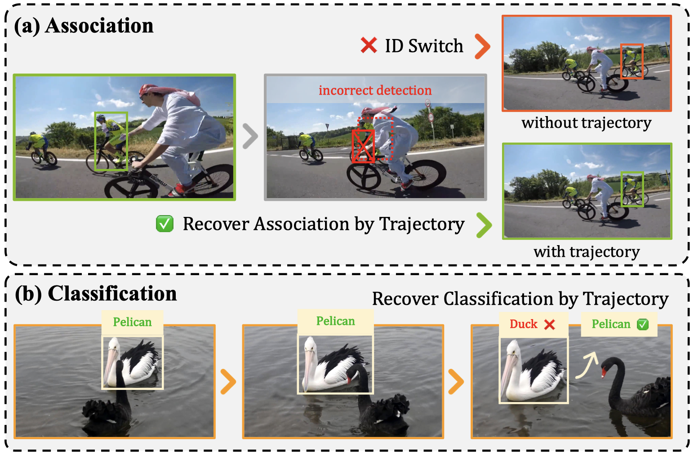

# TRACT: Trajectory-Aware Open-Vocabulary Tracking

**Attention to Trajectory: Trajectory-Aware Open-Vocabulary Tracking**

Yunhao Li, Yifan Jiao, Dan Meng, Heng Fan*, Libo Zhang* <br>
International Conference on Computer Vision (ICCV), 2025. (*equal advising and co-last author)

[](https://arxiv.org/abs/2503.08145)
[](#)

## 🎯 Overview

<p float="left">
  
  
</p>

Despite recent progress, current Open-Vocabulary Multi-Object Tracking (OV-MOT) methods largely focus on instance-level information while overlooking trajectory-level cues. Although some introduce novel association strategies, they neglect trajectory information—an essential component in videos and a staple in classic MOT. This limits their ability to exploit contextual continuity. 

In contrast, our **TRACT** framework incorporates trajectory-level cues through three key strategies:
- **TCR (Trajectory Consistency Reinforcement)**: Enforces consistency within trajectories
- **TFA (Trajectory-aware Feature Aggregation)**: Aggregates features across trajectory history  
- **TSE (Trajectory Semantic Enhancement)**: Enhances semantic understanding using trajectory context

## 🏗️ Architecture


**TRACT Framework Overview**: Our approach uses a replaceable open-vocabulary detector to generate boxes of arbitrary categories. These detection results are used for trajectory association, where TRACT leverages trajectory information in both the trajectory-enhanced association and trajectory-assisted classification steps.

## 🚀 Key Features

- **Universal Open-Vocabulary Tracking**: Track any object categories without specific training
- **Trajectory-Aware Design**: Incorporates temporal consistency and trajectory-level reasoning
- **Strong Performance**: Achieves state-of-the-art results on multiple benchmarks

## 📦 Project Structure

This repository contains two main components:

### 1. Trajectory-aware MASA (Matching Anything by Segmenting Anything)
- **Location**: `./masa/`
- **Purpose**: Universal instance appearance model for object association
- **Features**: Zero-shot tracking capabilities across diverse domains

### 2. TraCLIP (Trajectory-aware CLIP)
- **Location**: `./TraCLIP/`
- **Purpose**: Trajectory-aware classification using CLIP features
- **Features**: Temporal feature aggregation and trajectory semantic enhancement

## ⚙️ Installation

### Prerequisites
- Linux or macOS
- Python >= 3.9
- PyTorch >= 2.1.2
- CUDA >= 11.8 (recommended)

### Step 1: Clone Repository
```bash
git clone https://github.com/your-repo/TRACT.git
cd TRACT
```

### Step 2: Install MASA Dependencies
```bash
cd masa
conda env create -f environment.yml
conda activate masaenv

# Option 1: Automated installation
sh install_dependencies.sh

# Option 2: Manual installation
pip install -U openmim
mim install mmengine
pip install mmcv==2.1.0 -f https://download.openmmlab.com/mmcv/dist/cu118/torch2.1/index.html
pip install git+https://github.com/open-mmlab/mmdetection.git@v3.3.0
pip install -r requirements.txt
```

### Step 3: Install TraCLIP Dependencies
```bash
cd ../TraCLIP
pip install -r requirements.txt

# Install additional packages
pip install clip-by-openai
pip install timm
pip install tqdm
```

## 🔧 Usage

## 📁 Data Preparation

### TAO Dataset
1. Download TAO dataset from [official website](https://taodataset.org/)
2. Organize the data structure as shown in `TraCLIP/datasets/`
3. Generate tracklet datasets using provided scripts

### Custom Dataset
Follow the data format specifications in `TraCLIP/readme.md` for custom datasets.

## 🛠️ Troubleshooting

### Common Issues

1. **CUDA out of memory**: Reduce batch size or use gradient accumulation
2. **Missing dependencies**: Ensure all packages in requirements.txt are installed
3. **Model loading errors**: Check model paths and download pre-trained weights

## 🙏 Acknowledgements

Our code repository is built upon:
- [MASA](https://github.com/siyuanliii/masa) - Universal instance appearance modeling
- [MMDetection](https://github.com/open-mmlab/mmdetection) - Object detection framework
- [CLIP](https://github.com/openai/CLIP) - Vision-language pre-training

Thanks for their wonderful work!

## 📖 Citation

If you find this project useful for your research, please use the following BibTeX entry:

```bibtex
@inproceedings{li2025tract,
  title={Attention to Trajectory: Trajectory-Aware Open-Vocabulary Tracking},
  author={Li, Yunhao and Jiao, Yifan and Meng, Dan and Fan, Heng and Zhang, Libo},
  booktitle={International Conference on Computer Vision (ICCV)},
  year={2025}
}
```
